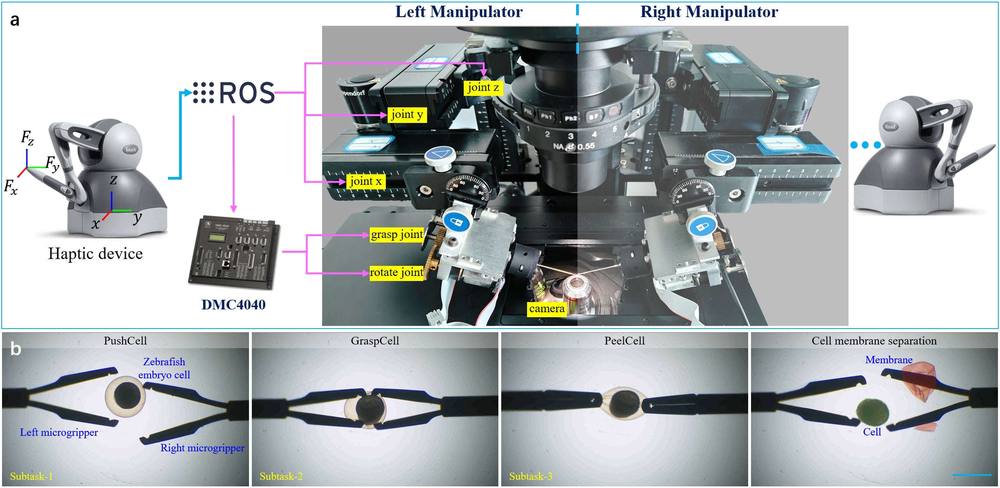
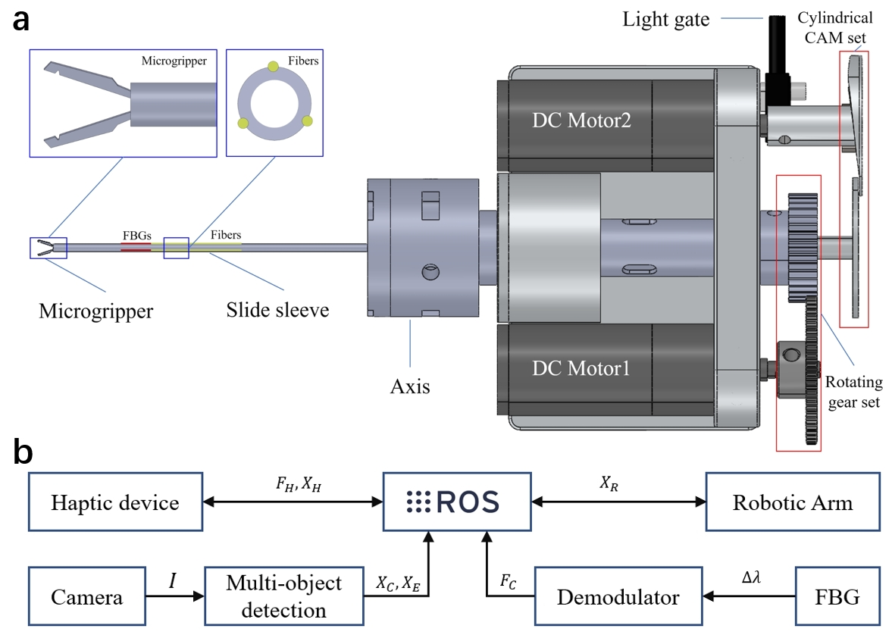
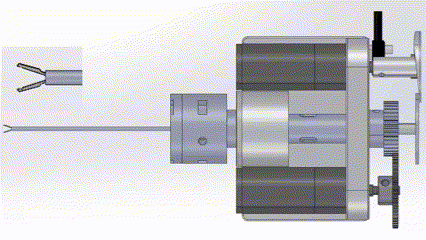
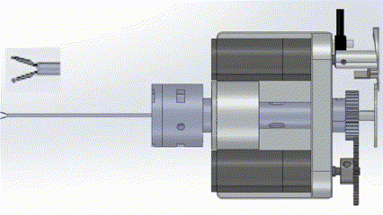
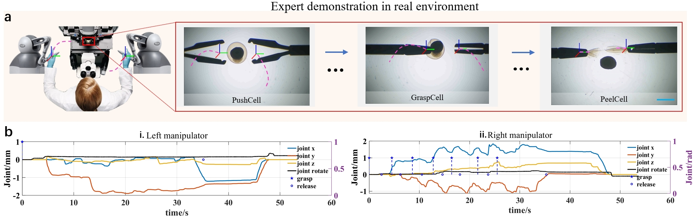
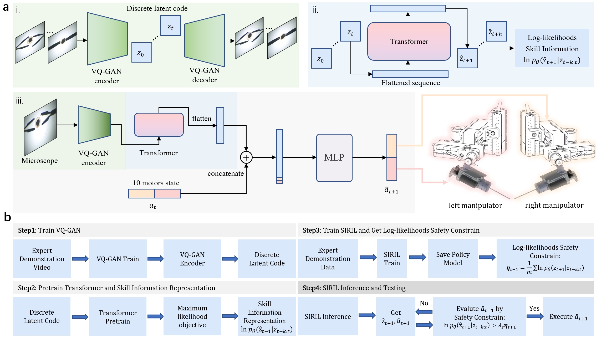
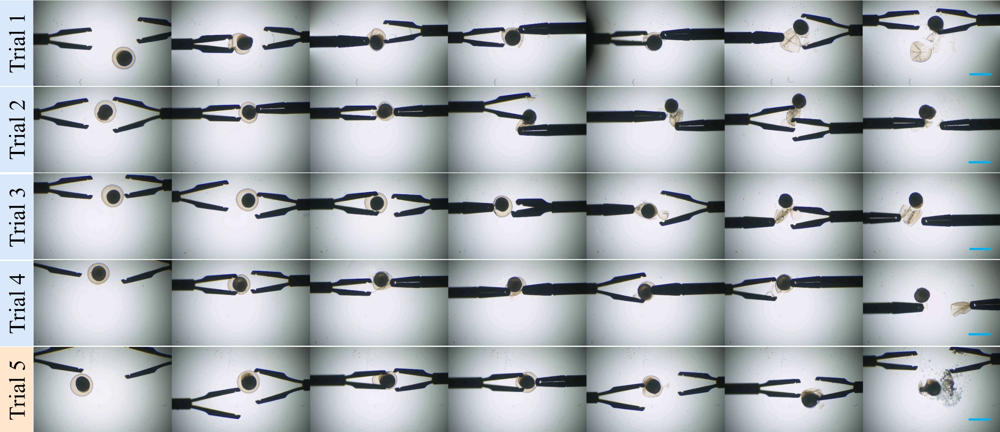
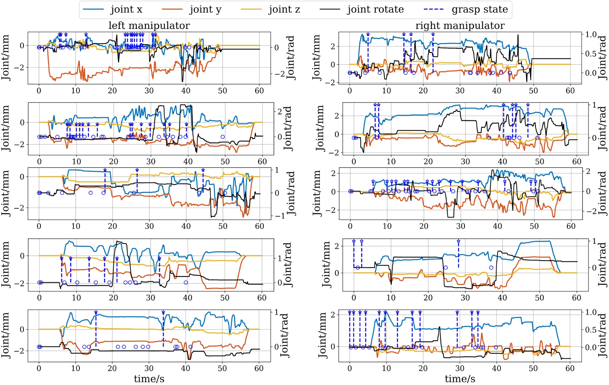

# Imitation Learning for Dexterous Robot Micromanipulation of Deformable Cell

## 1.Robot design 🤖
### Robot overview

  

a, Hardware structure diagram of the robot system. The robotic system primarily consists of two symmetric three-axis micromanipulation robotic arms, motor controllers, two force-feedback devices, and a micromanipulation end-effector integrated at the end of each robotic arm. b, Images under the microscope about robot performing collaborative, long-horizon dexterity micromanipulation task of cell membrane peeling. The task mainly includes three sub-tasks: reaching and pushing the cell, grasping the cell, and tearing off the cell membrane. The scale bar is 800 $\mu$ m. 

### End-effector

  

a, Schematic of the mechanical structure of the microgripper. The microgripper has two degrees of freedom: a gripping action and a wrist-like rotational motion. Axial rotation is achieved by driving a set of rotating gears with DC motor 1. The gripping action is performed by DC motor 2, which pushes a sliding sleeve through a cylindrical cam mechanism. Three Fiber Bragg Gratings (FBGs) are integrated on the sliding sleeve to sense bending deformation, providing force sensing and collision detection to prevent breakage of the microgripper. b, Diagram of Data Communication Nodes in the Robotic System. The software and control part of the system was integrated into the Robot Operating System (ROS) Melodic.

<table align=center>

  <tr align=center>
    <td>
      
    </td>
    <td>
      
    </td>
  </tr>

  <tr align=center>
    <td>
      DoF1: grasp
    </td>
    <td>
      DoF2: rotate
    </td>
  </tr>

</table>

## 2.Imitation Learning

### 👨‍⚕️Get expert data

  

a, The expert remotely operated the robotic system using force-feedback devices to collect demonstration data. During the expert demonstration, video information, end-effector trajectories, axial rotation angles, grasping actions, and multi-joint trajectories of the robotic arm were recorded on the ROS platform. The scale bar is 800 $\mu$m. b, Visualization of recorded demonstration data. (a) Data from the robot’s left arm, including the three-axis robotic arm trajectory (left y-axis), the microgripper’s axial rotation angle (right y-axis), and the microgripper’s gripping actions. (b) Data from the robot’s right arm. The manipulator trajectory values are on the left axis. Microgripper rotation, grasp, and release are on the right axis.

### 🧠SIRIL 

  

a, Schematic of the SIRIL network structure. (i) VQ-GAN Encoder and Decoder Architecture: The input consists of workspace video frames, generating corresponding images. The encoder compresses video frame information into discrete latent codes. (ii) an Autoregressive transformer Model: The input is the latent code of the video frame from the previous time step, while the output is the predicted latent code for the next time step. This allows for calculating the likelihood of past latent codes relative to the current time step. (iii) Network Structure for Controlling the Robot's Left and Right Manipulators and Microgrippers: Video frame information is effectively encoded by the pre-trained VQ-GAN encoder, followed by the transformer predicting the latent code for the next time step. The encoded tensor is flattened and fused with the previous time step’s robot action information, then input to a multi-layer perception network to generate the final robot actions. b, Overview of the SIRIL Training and Inference Pipeline. Step 1: Utilize expert demonstration videos to train a VQ-GAN, extracting discrete latent codes. Step 2: Leverage these codes to pretrain an autoregressive transformer for skill information representation. Step 3: Employ behavior cloning to train SIRIL and preserve the policy model. Step 4: In inference, actions are predicted, verified against safety constraints, and executed if they comply.

### 🚀Result

SIRIL and Baselines Success Rate
| **Method**     | **PushCell(%)**  | **GraspCell(%)**  | **PeelCell(%)**  | **Mean (%)** | **Final (%)**     |
|-----------------|----------------|-----------------|----------------|--------------|-------------------|
| BC             | 93.3 (28/30)   | 32.1 (9/28)    | 33.3 (6/9)    | 52.9         | 20.0 (6/30)       |
| ACT            | 96.7 (29/30)   | 58.6 (17/29)   | 76.5 (13/17)  | 77.2         | 43.3 (13/30)      |
| VINN           | 96.7 (29/30)   | 31.0 (9/29)    | 22.2 (2/9)    | 43.3         | 6.67 (2/30)       |
| Diffusion      | 76.7 (23/30)   | 26.1 (6/23)    | N/A (0/6)     | 34.3         | N/A (0/30)        |
| Beginner RC    | 83.3 (25/30)   | 72.0 (18/25)   | 88.9 (16/18)  | 81.4         | 53.3 (16/30)      |
| SIRIL(0.8)     | 96.7 (29/30)   | 82.8 (24/29)   | 79.2 (19/24)  | 86.2         | 63.3 (19/30)      |

<table align=center>
  <tr align=center>
    <td>
      
    </td>
    <td>
      
    </td>
  </tr>
  <tr align=center>
    <td>
      Images of the SIRIL strategy for controlling the robotic system to perform the cell membrane tearing process. Trial 1, 2, 3 and 4 are the images of the successful task. Trial 5 is the image of the failed task. The scale bar is 800 $\mu$m. 
    </td>
    <td>
      Trajectories of the SIRIL strategy for controlling the robotic system to perform the cell membrane tearing process. The top four are successful trials 1-4, and the bottom is failed trial.
    </td>
  </tr>

</table>

### 📹Automated surgery
<table align=center>

  <tr align=center>
    <td>
      
    </td>
    <td>
      
    </td>
  </tr>

  <tr align=center>
    <td>
      trail1
    </td>
    <td>
      trail2
    </td>
  </tr>

</table>

# Source code for robot system
1. phantom touch as master device
2. eppendorf TranferMan 4R as slave device (velocity-control)
3. self-designed 2-dof forcep
4. micro machine vision system
5. SIRIL

- [x] master-slave control for biarm
- [x] master-slave control for forcep
- [x] imitation learning 
