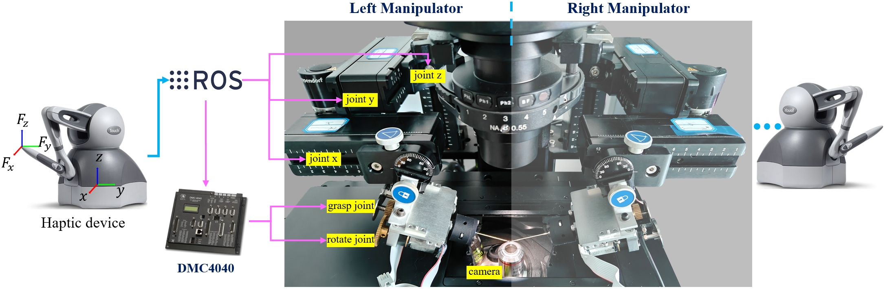
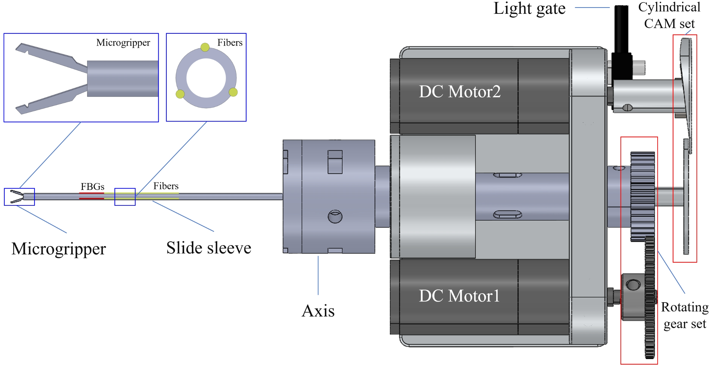
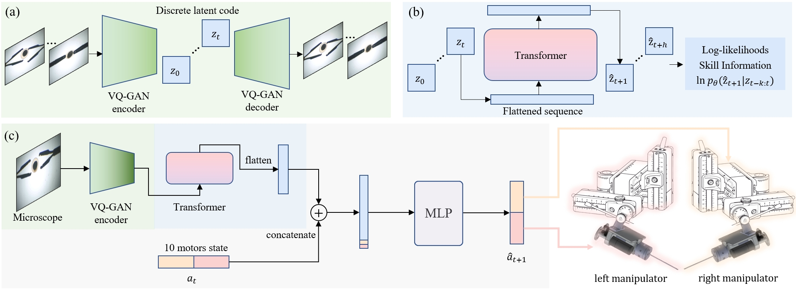

# Skill Information Representation Imitation Learning for Long-horizon Dexterous Robot Micromanipulation of Deformable Cell

## Robot design
### Robot overview

  

The robotic system primarily consists of two symmetric three-axis micromanipulation robotic arms, motor controllers, two force-feedback devices, and a micromanipulation end-effector integrated at the end of each robotic arm.

### End-effector

  

The microgripper has two degrees of freedom: a gripping action and a wrist-like rotational motion. Axial rotation is achieved by driving a set of rotating gears with DC motor 1. The gripping action is performed by DC motor 2, which pushes a sliding sleeve through a cylindrical cam mechanism. Three Fiber Bragg Gratings (FBGs) are integrated on the sliding sleeve to sense bending deformation, providing force sensing and collision detection to prevent breakage of the microgripper.

<table>

  <tr>
    <td>
      grasp
    </td>
    <td>
      rotate
    </td>
  </tr>

  <tr>
    <td>
      
    </td>
    <td>
      
    </td>
  </tr>
</table>

## SIRIL

## Source code for robot system
1. phantom touch as master device
2. eppendorf TranferMan 4R as slave device (velocity-control)
3. self-designed 2-dof forcep
4. micro machine vision system
5. SIRIL

- [x] master-slave control for biarm
- [x] master-slave control for forcep
- [x] imitation learning 
